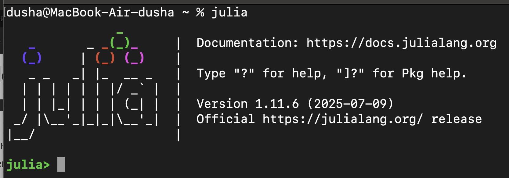
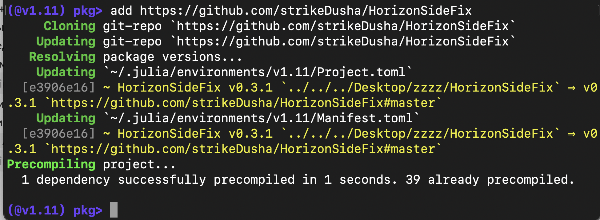

# РОБОТ НА КЛЕТЧАТОМ ПОЛЕ СО СТОРОНАМИ ГОРИЗОНТА

# Исправление ошибки с анимацией

Это пакет `HorizonSideFix`, который исправляет ошибки с новой  версией библиотеки, которые не совместимы со старой кодовой базой 
В остальном это тот же [HorizonSideRobots](https://github.com/Vibof/HorizonSideRobots.jl) в своей логике, но лишь с исправлением ошибок несовместимости
# Установка 
Такая же простая как и оригинальный пакет
показывать буду на примере macOS, но те же комманды справедливы и на других системах
Вводим слово `julia` в терминал

Нажимаем на `]` для открытия пакетного менеджера 
Пишем там `add https://github.com/strikeDusha/HorizonSideFix`

Выходим из меню пакетного менеджера (через Ctrl + C например)
и пишем `using HorizonSiteFix`
> ⚠️Важно!⚠️ Что бы все работало, **везде** где должно быть **HorizonSideRobots** пишите **HorizonSideFix**
>В остальном различий между пакетами нет 

дальше делаем что хотим, ведь **animate = true** работает!
**помогло - поставь звезду**

Данное ПО предназначено для поддержки начального курса программирования для студентов-первокурсников, целью которого является научить писать хорошо структурированный программный код, основываясь на технологии проектирования сверху вниз и включая использование идей обобщенного программирования. Оно помогает легко формулировать учебные задачи, сложность которых можно варьировать в достаточно широких пределах, и на которых можно научить/научиться всему заявленному, по крайней мере, в некотором приближении.

Лежащие в основе методические идеи восходят к учебнику Кушниренко А.Г. и Лебедева Г.В. «Программирование для математиков», 1988.

Курс базируется на языке программирования Julia. Этот язык очень выразительный, прост в изучении, обладает ясным и удобным синтаксисом, развитой системой типов, поддерживает основные на сегодняшний день парадигмы программирования, обладает хорошими интерактивными возможностями, динамически компилируемый, удачно спроектирован как для требовательных математических и технических вычислений, так и для общего программирования. [Официальный сайт разработчиков языка Julia](https://julialang.org/).

-----------------------------

## ОГЛАВЛЕНИЕ 

* [Как установить Робота на своем компьютере](https://vibof.github.io/HorizonSideRobots.jl/dev/setup.md)
* [Конструктор объектов типа Robot](https://vibof.github.io/HorizonSideRobots.jl/dev/constructor.md)
* [Командный интерфейс Робота](https://vibof.github.io/HorizonSideRobots.jl/dev/api.md)
* [Пример выполнения программы для Робота](https://vibof.github.io/HorizonSideRobots.jl/dev/example.md)
* [Начальные сведения о языке программирования Julia](https://vibof.github.io/HorizonSideRobots.jl/dev/language.md)

В Wiki-разделе имеется также [Руководство по программированию](https://github.com/Vibof/HorizonSideRobots.jl/wiki), которое находится пока в состоянии развития.

Для студентов 1-го курса потока КМБО института КИБЕРНЕТИКИ РТУ МИРЭА [инструкция](https://github.com/Vibof/Organizer) по организации учебного процесса на основе github
